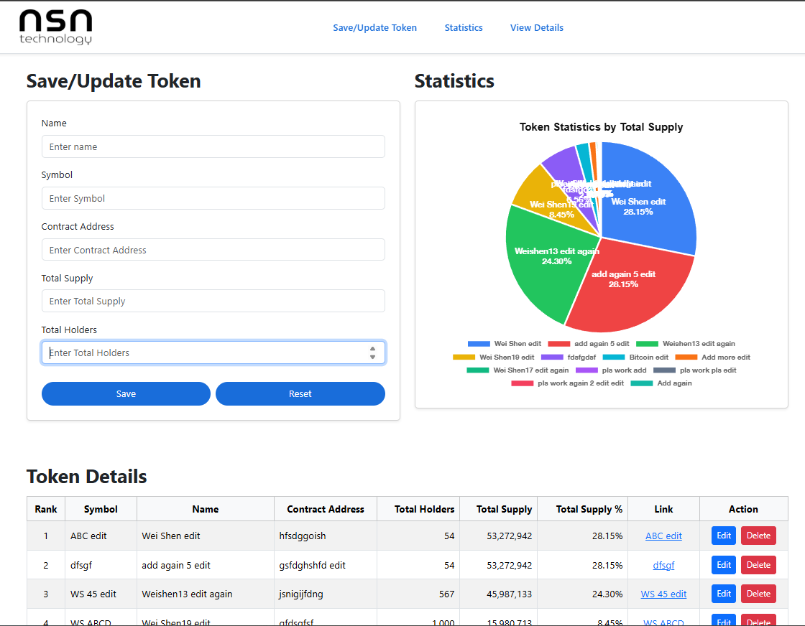

# NSN Technology Single Page Application
## Project Overview
A full-stack ASP.NET Core MVC + MySQL dashboard system that manages and visualizes token information. The app provides a responsive single-page interface with AJAX-based CRUD operations, dynamic charts, and CSRF-secured form submissions. Built with Razor views, Chart.js, and Entity Framework Core for a smooth, modern user experience.

## Project Objectives
The NSN Technology SPA is an ASP.NET Core MVC web application that serves as a token management and analytics dashboard.
It allows administrators to create, edit, and delete token records, visualize token supply distributions, and interact dynamically with the database — all within a single responsive page.

# Tech Stack
| Category              | Tools/Libraries                             |
| --------------------- | ------------------------------------------- |
| Frontend  | Razor Views, Bootstrap 5, Chart.js, JavaScript (Fetch API)                                      |
| Backend  | ASP.NET Core MVC 8.0                         |
| Database       | MySQL with Entity Framework Core               |
| Security       | ASP.NET Antiforgery Tokens (X-CSRF-TOKEN header)               |
| Hosting       | Cross-platform via Kestrel / IIS               |


# Instructions to Run
1. **Clone the repository**
   ```bash
   git clone https://github.com/weishen1113/NSN.git
   cd NSN
   ```

2. **Edit `appsettings.json` to point to your MySQL instance:**
   ```bash
   "ConnectionStrings": {
    "DefaultConnection": "Server=127.0.0.1;Port=3306;Database=nsn_tokens;User ID=nsn_user;Password=<your_password_here>;TreatTinyAsBoolean=false;"
    }
   ```

3. **Apply EF Core migrations (generate tables)**
    If your project includes EF migrations, run:
   ```bash
   dotnet ef database update
   ```
   - If you haven’t created migrations yet, generate them first:
   ```bash
   dotnet ef migrations add InitialCreate
   dotnet ef database update
   ```

4. **Run the application**
   ```bash
   dotnet run
   ```
   - Then open your browser at:
   ```bash
   https://localhost:5001
   ```

### Optional Extension
5. **Run the external Price Updater console app**
   - Repository: [NSN PriceUpdater](https://github.com/weishen1113/PriceUpdater)
   - This updates live token prices every 5 minutes in the main dashboard.

# User Interface Layout
<p align="center">
  
</p>
